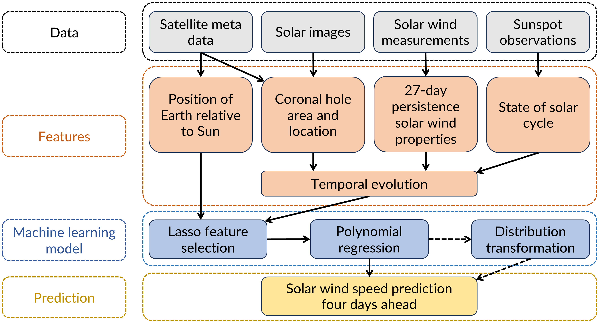

# Forecasting High-Speed Solar Wind Streams from Solar Images

Official repository for [Forecasting High-Speed Solar Wind Streams from Solar Images](https://doi.org/10.1029/2024SW004125), published in *Space Weather* (2025) by [Daniel Collin](https://www.linkedin.com/in/daniel-collin-52abb0205/), [Yuri Shprits](https://www.gfz.de/staff/yuri.shprits), [Stefan J. Hofmeister](https://www.astro.columbia.edu/content/stefan-hofmeister), [Stefano Bianco](https://www.linkedin.com/in/stefano-bianco-343096130/), and [Guillermo Gallego](http://www.guillermogallego.es).

<h2 align="left">

[Journal Publication](https://doi.org/10.1029/2024SW004125) | [Data Publication](https://doi.org/10.5880/GFZ.2.7.2024.001) | [Predictions for Comparison](https://github.com/DanielCollin96/hss_prediction/tree/main/results)
</h2>


## Citation
If you use this work in your research, please cite it as follows:

```bibtex
@article{Collin2025SpaceWeather,
  title   = {Forecasting High-Speed Solar Wind Streams from Solar Images},
  author  = {Collin, Daniel and Shprits, Yuri and Hofmeister, Stefan J. and Bianco, Stefano and Gallego, Guillermo},
  journal = {Space Weather},
  year    = {2025},
  doi     = {10.1029/2024SW004125}
}
```

## Framework

<div align="center">
  
</div>

#### Input Data

- Coronal hole segmentation maps (generated from solar images using the segmentation algorithm presented in [Inceoglu et al. (2022)](https://doi.org/10.3847/1538-4357/ac5f43)
- Solar wind properties
- Sunspot number
- Heliospheric latitude of Earth

#### Machine Learning Model

1. Feature selection is done using a linear regression model with Lasso regularization.
2. A polynomial regression model with Lasso regularization is trained as the main prediction algorithm. 
3. Optional: A distribution transformation based on the Box-Cox transform can be applied to the predictions to improve the fit of the underlying distribution and thereby high-speed stream peak predictions.

#### Output

- Solar wind speed in four days

## Dataset

The dataset used in the paper was published in [Collin et al. (2024)](https://doi.org/10.5880/GFZ.2.7.2024.001). Click on the link to download the dataset and reproduce the results.

## Installation & Usage

The code for our approach is provided in python files in the [code folder](https://github.com/DanielCollin96/hss_prediction/tree/main/code), each of which contains detailed annotations. There are two main scripts to run, which cover the following functionalities:

- Training and testing of the model using cross-validation: [`run_model.py`](https://github.com/DanielCollin96/hss_prediction/blob/main/code/run_model.py)
- Plotting the predicted time series: [`look_at_results.py`](https://github.com/DanielCollin96/hss_prediction/blob/main/code/look_at_results.py)

To use these notebooks, follow the installation guide below.

#### 1. Clone the repository
```
git clone https://github.com/DanielCollin96/hss_prediction.git
cd hss_prediction
```

#### 2. Set up the environemnt

We provide an [`environment.yml`](https://github.com/DanielCollin96/hss_prediction/blob/main/environment.yml) file to ensure compatibility with all dependencies. It can be installed using [Conda](https://docs.conda.io/projects/conda/en/stable/user-guide/getting-started.html).

```
conda env create -f environment.yml
conda activate ch_sws_prediction
```

#### 3. Download data

Download the dataset [here](https://doi.org/10.5880/GFZ.2.7.2024.001).

After downloading the data, create a folder `data/` next to the `code/` folder with the following structure:

```
data
 ├── hyperparameters.ods
 ├── datasets
 │    ├── alpha.csv
 │    ├── ml_data
 │    │     ├── 4x3.csv
 │    │     ├── ...
 │    │     └── 10x10.csv
 │    └── enhancements
 │          ├── cme_list.csv
 │          ├── hss_list.csv
 │          └── enhancement_list.csv
 └── segmentation_maps
      └── curated
            ├── 2010-05.pickle
            ├── ...
            └── 2019-12.pickle
```

#### 4. Configure script

Open the script [`run_model.py`](https://github.com/DanielCollin96/hss_prediction/blob/main/code/run_model.py). It runs a cross-validation for the specified model configurations. The model can be configured in the top part of the script. Further explanations are given in the script as comments, and a detailed explanation of the methodology can be found in the paper publication.

The script is currently configured to compute the cross-validation results for the 4x3 grid model, optimized towards minimizing the timeline RMSE. To compute the results for the second model that is mainly used in the paper, set `grid = '10x10'` and `target_metric = 'peak_rmse'`. This will compute the results for the 10x10 grid model, optimized towards the HSS peak velocity RMSE.

To create new datasets, based on other grid resolutions, specify the grid resolution and hyperparameters in `run_model.py`. Then, the program will automatically compute a new dataset based on the downsampled and curated coronal hole segmentation maps and save the dataset in the data folder.

#### 5. Run script

Run the script using the following command:

```
python run_model.py
```

#### 6. Access results

Results are stored in the `results/` folder, containing the subfolders `model_eval/` and `model_pred/`. The first one contains excel files summarizing the evaluation metrics, model coefficients and feature importance, and the second one contains pickle files storing the computed output, e.g., predictions and observations of the time series and high-speed streams. Additionally, the main `results/` folder contains csv files with the predicted time series that were presented in the paper (cv = cross-validation results, sc25 = operational predictions on solar cycle 25). Note that these time series also contain predictions for CME intervals. If these should be excluded, please use the provided CME list.

An example of how to access and plot the predictions stored in `model_pred/` is given in the script [`look_at_results.py`](https://github.com/DanielCollin96/hss_prediction/blob/main/code/look_at_results.py). The script can be modified to get the visualizations or evaluations needed. Run it using the following command:

```
python look_at_results.py
```

## Code developer

[Daniel Collin](https://www.linkedin.com/in/daniel-collin-52abb0205/). 

In case of questions or bugs, please contact Daniel at collin@gfz.de.


## License

This work is released under [MIT License](https://github.com/DanielCollin96/hss_prediction/blob/main/LICENSE).

   

